# 服务器部署前后端项目

## 安装jenkins
配置 Jenkins 官方 yum 源

```

wget -O /etc/yum.repos.d/jenkins.repo https://pkg.jenkins.io/redhat-stable/jenkins.repo

```
安装Jenkins
```

yum -y install jenkins

```
查看jenkins版本
```

rpm -qi jenkins | grep Version

```
jenkins版本推荐的jdk版本


| Jenkins 版本                 | 支持的最低 JDK         | 推荐 JDK       |
| -------------------------- | ----------------- | ------------ |
| Jenkins ≤ 2.361.x          | Java 8 或 Java 11  | Java 11      |
| Jenkins 2.362 ~ 2.414      | Java 11 或 Java 17 | Java 17      |
| Jenkins ≥ 2.414.1（LTS 当前版本 | 必须 Java 17+       | Java 17 或 21 |

## 安装jdk

可以根据下载的jenkins版本去下载对应的jdk版本（可以的话，建议多下载几个jdk版本，方便切换，这边下载的版本1.8，11，17），本人下载的jenkins版本为2.528.1

```

Version     : 2.528.1

```
jdk17下载地址：https://www.oracle.com/java/technologies/javase/jdk17-0-13-later-archive-downloads.html

上传至服务器，建议创建一个目录用于存放安装的应用，上传到服务器之后，使用

```

tar -zxvf jdk-17.0.15_linux-x64_bin.tar.gz 进行解压

```
解压完成之后，编写配置
```

进入配置文件：

vim /etc/profile

配置java环境

# java

export JAVA_HOME=/home/java/jdk17

export PATH=$JAVA_HOME/bin:$PATH

配置保存完成之后，刷新配置文件：

source /etc/profile

刷新完成之后，检查java环境：

java -version

```
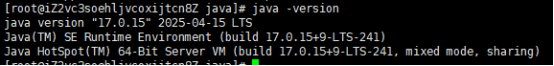
## 安装maven
maven下载地址：[Download Apache Maven – Maven](https://maven.apache.org/download.cgi)
选择一个版本进行下载
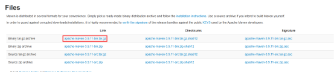

下载完成之后，上传到服务器对应的目录，上传完成之后，使用
```

tar -zxvf apache-maven-3.9.11-bin.tar.gz 进行解压

```
解压完成之后，编写配置
```

进入配置文件：

vim /etc/profile

配置java环境

# maven

export MAVEN_HOME=/home/maven/maven3.9.11

export PATH=${MAVEN_HOME}/bin:$PATH

配置保存完成之后，刷新配置文件：

source /etc/profile

刷新完成之后，检查maven环境：

mvn -v

```

maven环境配置好之后，修改maven配置
```

进入到maven保存的目录

cd conf

vim settings.xml

找到mirrors，配置镜像

<mirror>

      <id>alimaven</id>

      <name>aliyun maven</name>

      <url>http://maven.aliyun.com/nexus/content/groups/public/</url>

      <mirrorOf>central</mirrorOf>

</mirror>

可选：配置本地仓库地址

找到localRepository

<localRepository>/home/maven/repository</localRepository>

修改完之后，保存文件退出

```
## 运行Jenkins
jdk，maven配置完毕之后，就可以运行jenkins
```

启动命令

systemctl start jenkins

查看jenkins运行状态

systemctl status jenkins

```
（默认端口是8080，如果服务器安全组没开放，可以进行添加）
启动完毕之后，可以进行访问jenkins地址：服务器地址:8080，进入之后，输入默认密码
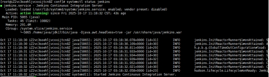
也可以通过
```

cat /var/lib/jenkins/secrets/initialAdminPassword

进行查看

```
登录成功之后，创建一个账户，选择新手推荐安装插件即可
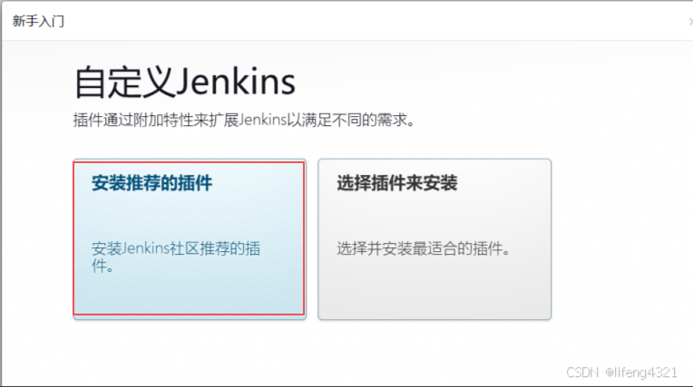

## Jenkins部署springboot项目
新建任务之前，保证您的目标服务器已经安装好了jdk，maven，git，假如您已经安装好之后，需要在jenkins中进行配置
### 配置maven
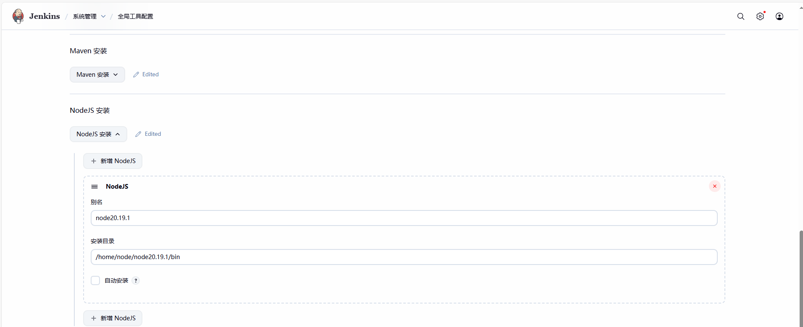

  

### 配置jdk

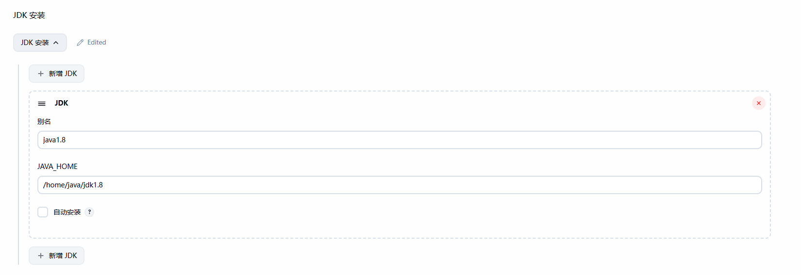
### 配置git
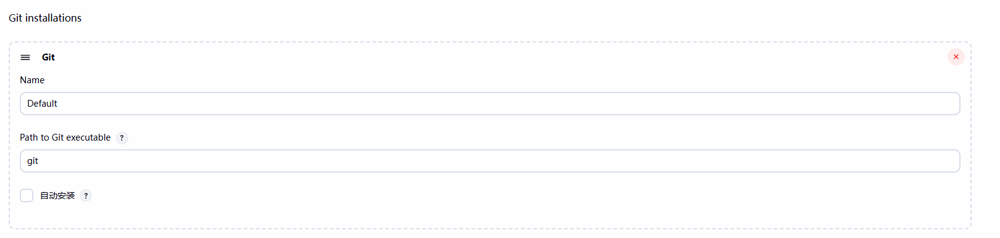
配置完毕之后，点击新建任务
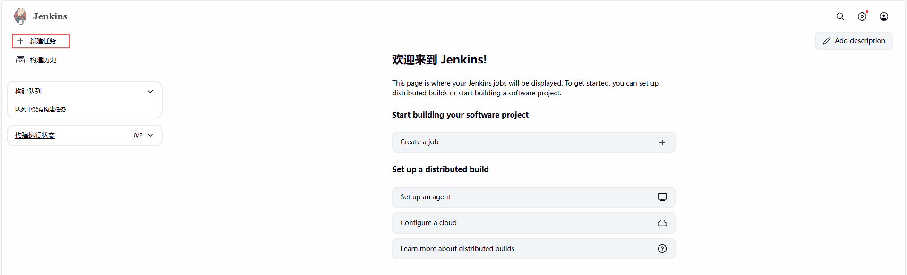

### 部署springboot项目
选择”构建一个maven项目“
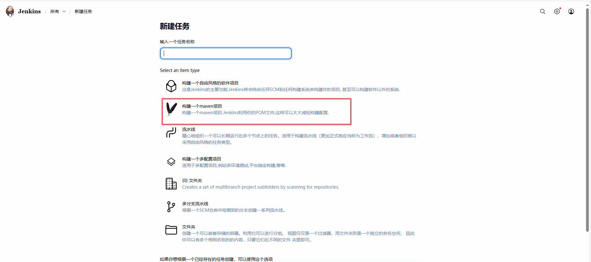

如果没有该选项，可以去插件管理进行下载
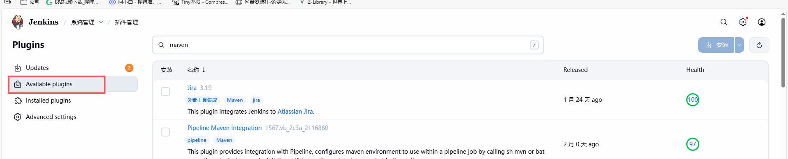

创建好项目之后，选择源码管理，选择git
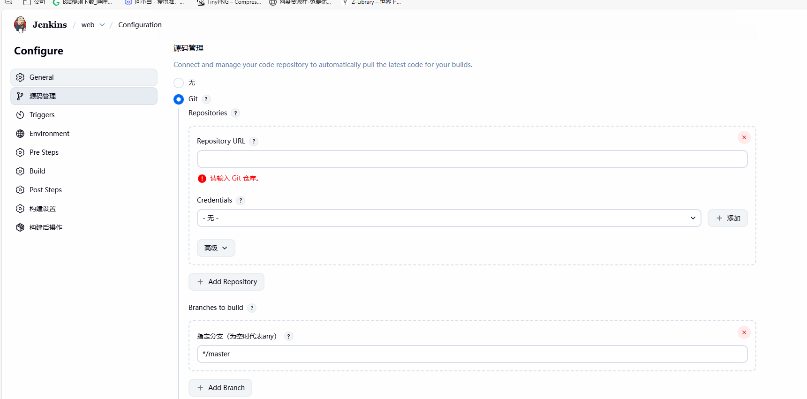

Repository URL：填写您的git地址
Credentials：填写凭据，我这里使用的是git账号
点击添加
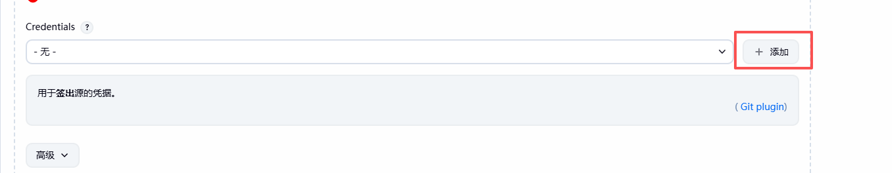

填写您的用户名和密码
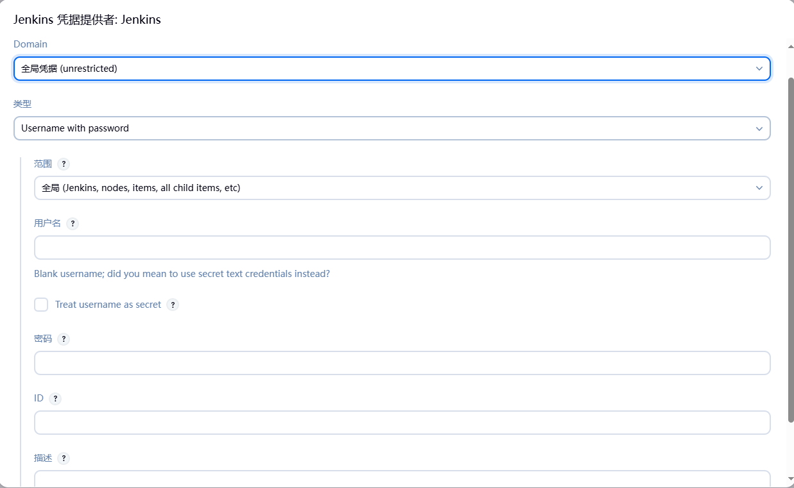
新增完毕之后，如下图
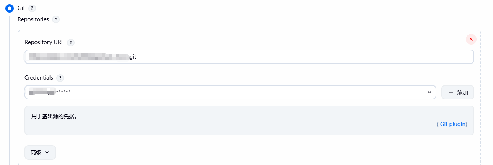

可以指定分支
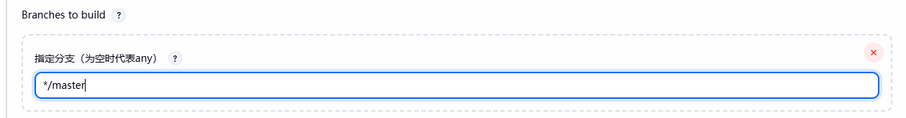
然后是pre steps，填写：clean install -Dmaven.test.skip=true，不用jenkins也会进行打包
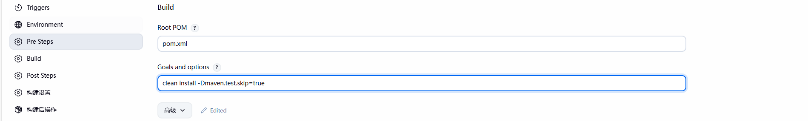

然后因为我们部署的是springboot项目，在jenkins完成打包之后，我们需要去执行项目运行的脚本，建议在服务器中单独写一个脚本，方便管理


填写：sh 你脚本存储的路径/脚本名称；我的执行命令是：
sh /home/java/project/web/deploy.sh prod
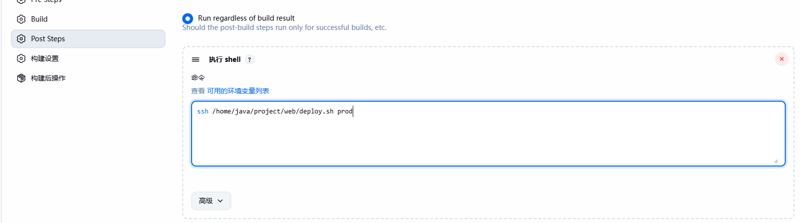

我的脚本是用ai生成的，如下
```shell

#!/bin/bash

# =========================================

# Jenkins 自动部署 & 多环境后台守护脚本

# =========================================

# ==== 配置区域 ====

ENVIRONMENT=${1:-prod}   # 默认环境 prod，可传参 dev/test/prod

JAR_NAME="web-back-api-0.0.1-SNAPSHOT.jar"

WORKSPACE="/var/lib/jenkins/workspace/web-api"

JAVA_HOME="/home/java/jdk17"

# ==== 根据环境选择部署目录和日志 ====

case "$ENVIRONMENT" in

  dev)

    TARGET_DIR="/home/java/project/web-dev"

    LOG_FILE="$TARGET_DIR/app-dev.log"

    ;;

  test)

    TARGET_DIR="/home/java/project/web-test"

    LOG_FILE="$TARGET_DIR/app-test.log"

    ;;

  prod)

    TARGET_DIR="/home/java/project/web"

    LOG_FILE="$TARGET_DIR/app.log"

    ;;

  *)

    echo "? 未知环境 $ENVIRONMENT"

    exit 1

    ;;

esac

  

echo "部署环境: $ENVIRONMENT"

echo "部署目录: $TARGET_DIR"

echo "日志文件: $LOG_FILE"

  

# ==== 1 停止旧进程 ====

PID=$(ps -ef | grep "$JAR_NAME" | grep -v grep | awk '{print $2}')

if [ -n "$PID" ]; then

  echo "发现旧进程 PID=$PID，正在终止..."

  kill -9 $PID

  sleep 2

else

  echo "没有发现旧进程。"

fi

  

# ==== 2 准备部署目录 ====

mkdir -p "$TARGET_DIR"

chown -R jenkins:jenkins "$TARGET_DIR"

  

# ==== 3 拷贝新 Jar 包 ====

cp -f "$WORKSPACE/target/$JAR_NAME" "$TARGET_DIR/"

if [ $? -ne 0 ]; then

  echo "? Jar 包拷贝失败，请检查权限或路径"

  exit 1

fi

  

# ==== 4 启动新服务（长期后台守护） ====

cd "$TARGET_DIR" || exit

  

# 防止 Jenkins 构建完成杀掉进程

export BUILD_ID=dontKillMe

  

# 后台启动，脱离终端

setsid "$JAVA_HOME/bin/java" -jar "$JAR_NAME" > "$LOG_FILE" 2>&1 < /dev/null &

NEW_PID=$!

  

sleep 5

  

# ==== 5?? 检查启动状态 ====

if ps -p $NEW_PID > /dev/null; then

  echo "? 服务已启动，PID=$NEW_PID"

  echo "?? 日志文件: $LOG_FILE"

else

  echo "?? 启动失败，请检查日志：$LOG_FILE"

  tail -n 30 "$LOG_FILE"

  exit 1

fi

  

echo "====================="

echo "部署完成，后台运行中..."

  

```

这样，一个springboot项目就创建好了，接下来启动jenkins部署项目
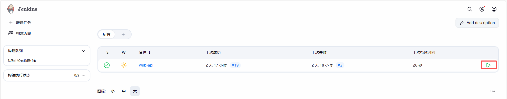

查看控制台输出，显示：Finished: SUCCESS
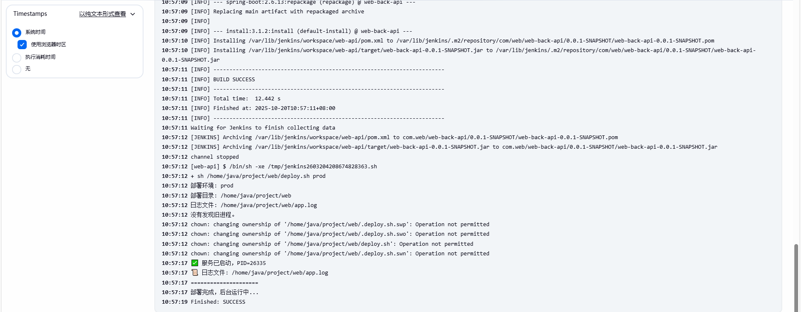

接下来，可以去服务器查看是否部署成功
查看进程：ps -ef | grep "java"，可以看到已经启动成功了
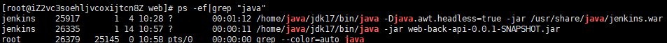
也可以通过端口号查看是否有项目启动的端口号：netstat -tunlp | grep "5001"，也可以看到项目已经是启动的了
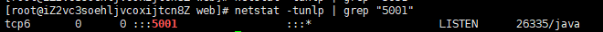
这样，jenkins部署springboot项目就部署完成了
## Jenkins部署vue项目
### 下载node
先下载node地址，可以先看看本地启动项目的node版本是多少，然后去官网下载对应版本。我本地使用的版本是node20.19.1。
node下载地址：[下载 | Node.js 中文网](https://nodejs.cn/download/)
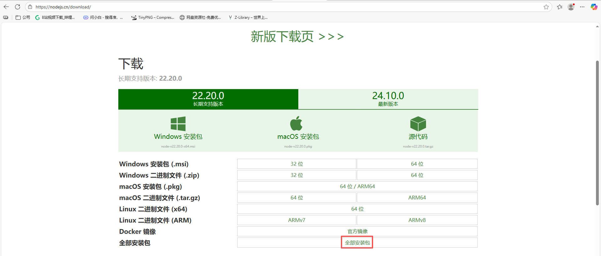

选择对应node版本
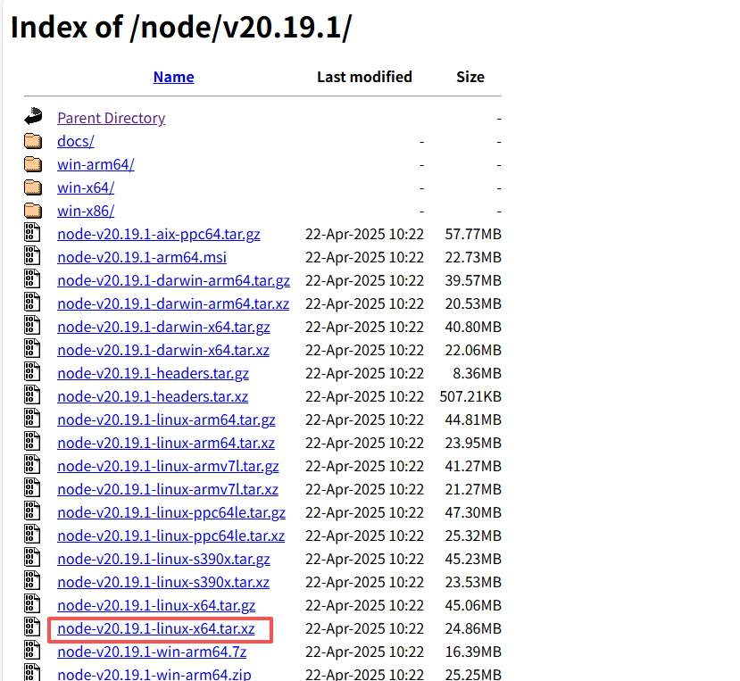

下载完成之后，和安装jdk的操作是差不多的，上传压缩包到服务器对应目录，然后进行解压，解压之后如下图：
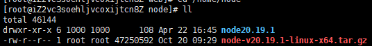
解压完成之后，进行配置环境变量
```

vim /etc/profile

填写您的node路径

#node

export NODE_HOME=/home/node/node20.19.1

export PATH=$PATH:$NODE_HOME/bin

填写完毕之后，保存退出

输入：vim /etc/profile

然后可以使用node -v，npm -v查看node是否生效

```

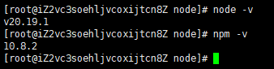
### jenkins部署环境变量
node安装完毕之后，我们需要去jenkins下载node插件
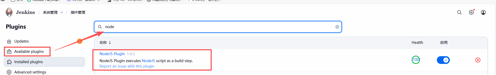

下载好之后，去全局工具进行配置


  

配置完毕之后，可以开始部署vue项目了
### 部署vue项目
点击新建项目，填写项目名，选择"构建一个自由风格的软件项目"
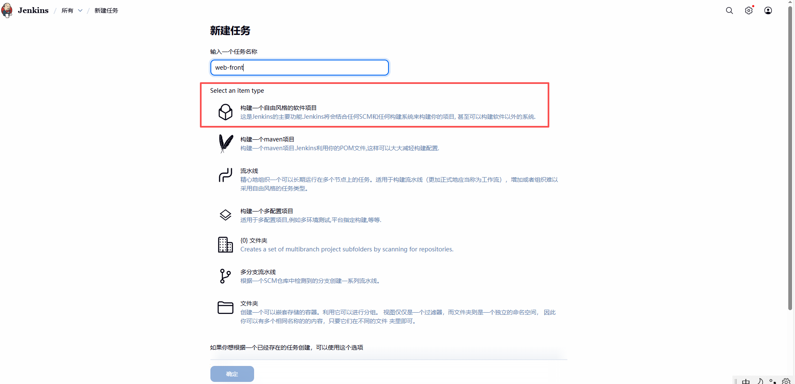

  


填写项目git地址，选择凭据，填写分支，如果凭据是不同的，可以进行新增对应的凭据，然后进行选择。

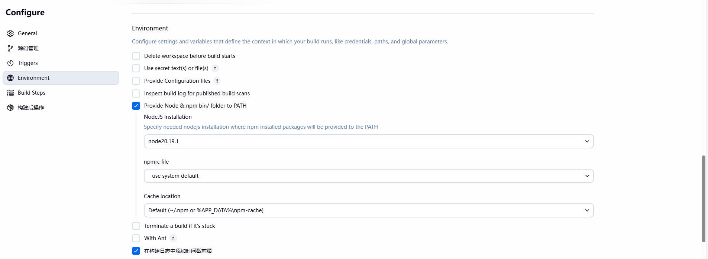

  

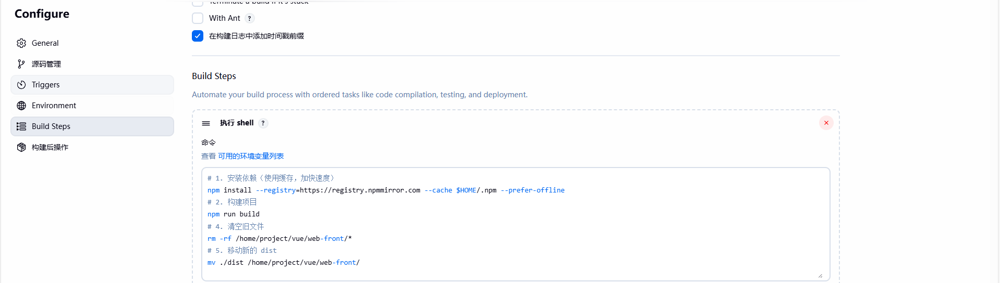

  
配置完毕之后，点击保存，就可以进行启动
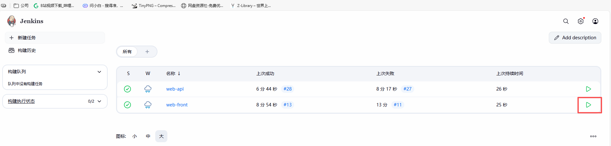

启动成功之后，去到我们保存的路径进行查看

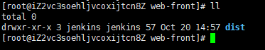

前后端项目部署完毕之后，就需要使用nginx，进行一个前后端的联调

## 部署nginx

**nginx有很多细致的东西，但是此文章只展示如何使用nginx部署项目**

下载nginx：[nginx: download](https://nginx.org/en/download.html)

选择一个稳定版本进行下载


  

下载完毕之后，上传到服务器，进行解压，解压完毕之后，进入到nginx目录

```

可以先进行下载依赖

yum install -y gcc-c++ pcre pcre-devel zlib zlib-devel openssl openssl-devel

然后进行：./configure

如果缺失依赖，可以百度进行查询

```

执行成功之后，如下图所示

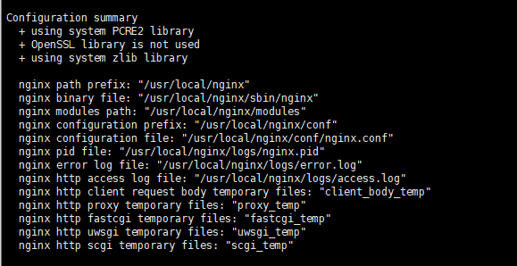

执行完毕之后，进行编译

```

make&&make install

```
出现以下所示，表示成功
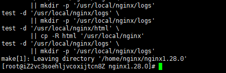

接下来，启动nginx

```

cd /usr/local/nginx/sbin

./nginx

可以通过

netstat -tunlp 查看是否成功

然后网页访问：ip:80

如果访问不成功，可以查看安全组是否放开80端口号

```

启动完毕之后，我们需要配置nginx，去访问我们的前端项目
进入到nginx目录
```sh

/usr/local/nginx/conf

```
修改配置文件
```

vim nginx.cofig

找到server块

添加配置

 # 官网访问地址

    server {

      listen 5021; # 监听的端口号

      server_name _; # 域名，没有的话使用_代替

      root /home/project/vue/web-office-front/dist; # 前端dist保存的地址

      # 支持 Vue history 路由

      location / {

          try_files $uri $uri/ /index.html;

          index index.html;

      }

  location /api/ {

     proxy_pass http://ip:5001/web/; # 后端访问接口，反向代理

           proxy_set_header Host $host;

           proxy_set_header X-Real-IP $remote_addr;

           proxy_set_header X-Forwarded-For $proxy_add_x_forwarded_for;

  }

      # 静态资源缓存

      location /static/ {

          alias /home/project/vue/web-office-front/dist/static/;

          expires 30d; # 静态资源保存的时间

     }

      # 错误页面

      error_page 404 /index.html;

      error_page 500 502 503 504 /50x.html

      location = /50x.html {

          root /home/project/vue/web-office--front/dist;

      }

    }

```
填写完毕，就可以保存退出
```

nginx -t # 检查配置文件是否有问题

nginx -s reload # 重新加载配置文件

```


接下来就可以通过ip:监听的端口号访问对应的前端项目，如果提示无法访问，可以查看网关的端口号是否放开

至此，Jenkins部署前后端项目，然后通过nginx实现前端访问后端到此结束。
## 我遇到的问题❗❗❗❗❗❗

```

systemctl start jenkins

启动之后如果出现

Job for jenkins.service failed because the control process exited with error code.

See "systemctl status jenkins.service" and "journalctl -xe" for details.

那就是启动失败了，可以一步一步进行排查

1.查看端口号是否被占用

netstat -tulnp | grep 8080

如果被占用，可以进行修改jenkins的端口

  - vim /usr/lib/systemd/system/jenkins.service

  - 找到：Environment="JENKINS_PORT=8080"

  - 修改 JENKINS_PORT=xxxx

  - 重新加载配置文件 systemctl daemon-reload

2.检查安装的jdk版本是否支持jenkins版本

如何不适配，修改jdk版本

3.查看jenkins输出日志

journalctl -xeu jenkins | tail -n 50

如果是主线程直接退出，可以检查一下启动命令是否有问题

查看启动命令路径：cat /usr/lib/systemd/system/jenkins.service | grep ExecStart

如果只出现：ExecStart=/usr/bin/jenkins那就说明启动配置文件有问题，那就可以进行下一步操作

查看java的路径：which java

查看jenkinswar包的路径：find / -name jenkins.war 2>/dev/null

修改对应配置：

sudo sed -i 's#ExecStart=.*#ExecStart=/usr/bin/java -jar /usr/lib/jenkins/jenkins.war#g' /usr/lib/systemd/system/jenkins.service

修改完成之后：

systemctl daemon-reload

systemctl enable jenkins

systemctl restart jenkins

如何查看启动之后的状态：

systemctl status jenkins -l

就会出现

[root@iZ2vc3soehljvcoxijtcn8Z java]# systemctl status jenkins l

Unit l.service could not be found.

● jenkins.service - Jenkins Continuous Integration Server

   Loaded: loaded (/usr/lib/systemd/system/jenkins.service; enabled; vendor preset: disabled)

   Active: active (running) since Fri 2025-10-17 11:18:32 CST; 25min ago

 Main PID: 5865 (java)

    Tasks: 38 (limit: 10882)

   Memory: 301.4M

   CGroup: /system.slice/jenkins.service

           └─5865 /home/java/jdk17/bin/java -Djava.awt.headless=true -jar

4.会提示用户jenkins没有对应的权限，可以给jenkins用户操作对应文件的权限

chown -R jenkins:jenkins /var/lib/jenkins /var/log/jenkins /var/cache/jenkins

权限问题是遇到最多的，如果出现permission defined 就进行给权限，因为Jenkins是Jenkins用户进行启动的，导致他的权限有限。

	```